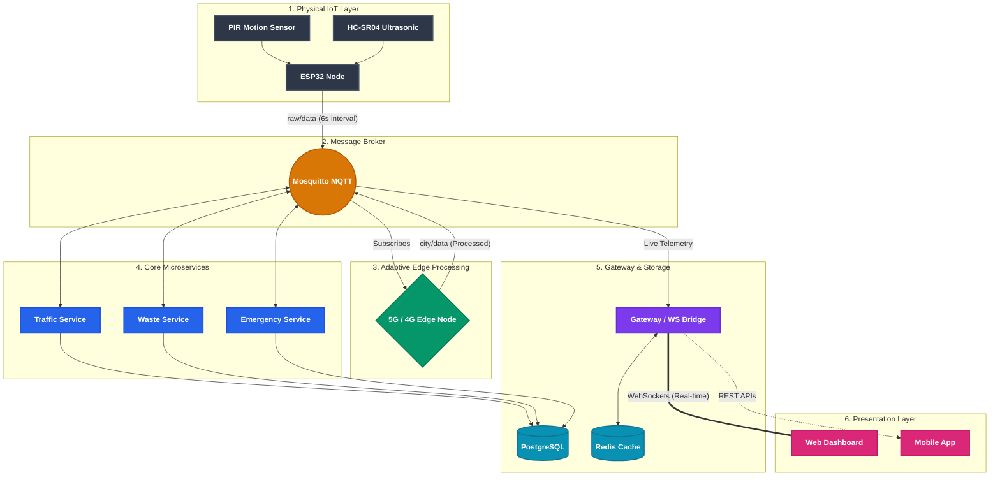

# 🏙️ NexaCity | 5G-Enabled Smart Urban Ecosystem


NexaCity is a state-of-the-art smart city infrastructure platform that bridges the gap between physical IoT hardware, high-speed telemetry, and AI-driven urban management. Built for scale and responsiveness, it features real-time 5G simulation, adaptive edge computing, and a premium web-based command center.

---

## 💻 Technology Stack

**Frontend & Authentication**
- **Web Dashboard**: React.js (Vite), Real-time WebSockets, Glassmorphism UI
- **Mobile App**: React Native 
- **User Verification**: Firebase Authentication (Role-Based Access Control)

**Backend Microservices**
- **Gateway & APIs**: Node.js / Express.js
- **Data Processing**: Python (Adaptive Edge Node)
- **IoT Message Broker**: Eclipse Mosquitto (MQTT Protocol)

**Data Layer**
- **Primary Database**: PostgreSQL (with PostGIS for spatial mapping)
- **High-Speed Cache**: Redis (For socket bridging and traffic states)

**Hardware & Edge Devices**
- **Microcontrollers**: ESP32 / Arduino / NodeMCU ESP8266
- **Sensors**: HC-SR04 (Ultrasonic), HC-SR501 (PIR Motion), ESP32-CAM / OV7670

**Infrastructure**
- **Containerization**: Docker & Docker Compose

---

## 🏗️ System Architecture & Block Diagram

NexaCity operates on a highly decoupled microservices architecture designed for real-time data ingestion and low-latency response. The following block diagram illustrates the end-to-end data pipeline from physical sensors to the user interface.



### 🧱 Block Diagram Components:
1. **IoT Edge Layer**: Physical ESP32 microcontrollers gather real-time data from localized sensors and transmit telemetry via lightweight MQTT protocols.
2. **Adaptive Edge Node**: A Python service that dynamically adjusts data aggregation based on simulated network status (5G vs 4G Fallback) to optimize bandwidth.
3. **Microservices Cluster**: Specialized Node.js and Python workers process distinct data streams (Traffic, Waste, Utilities).
4. **Gateway / WS Bridge**: Consolidates MQTT streams and bridges them to frontend clients using WebSockets for sub-millisecond UI updates.
5. **Data Layer**: PostgreSQL with PostGIS handles persistent, spatial data, while Redis drives high-speed caching.

---

## 🚀 Key Innovation Pillars

### 📡 5G Adaptive Edge Computing
NexaCity utilizes a custom **Adaptive Edge Node** (`edge_node.py`) to actively monitor network conditions.
- **5G Mode**: High-resolution, instantaneous data forwarding for real-time traffic signal adjustments.
- **4G Fallback**: Intelligently aggregates telemetry data to conserve bandwidth while maintaining urban monitoring integrity.

### 🚦 Smart Traffic Command Center
- **Sustained Traffic Detection**: Automated **Red Alerts** triggered by 30-second continuous vehicle detection (synchronized directly with the hardware PIR reset intervals).
- **Emergency Corridor Clearing**: Instant manual signal overrides for first responders.
- **Traffic Intensity Analytics**: Data is translated from raw telemetry into readable UX statuses (Smooth, Busy, Crowded) based on live rolling averages.

### 🗑️ Smart Waste Management
- **30s Status Resolution**: Intelligent dashboard throttling that prevents UI flicker while strictly monitoring bin fill levels and battery health.
- **Priority Collection Optimizer**: Predictive algorithms prioritize bins that need immediate physical collection.

---

## 🔌 Hardware Spec & Wiring (ESP32)

Engineered for high reliability with a "Zero-Resistor" direct-wiring path. The embedded firmware publishes MQTT payloads exactly every 6 seconds to align with hardware sensor constraints.

| Component | ESP32 Pin | Purpose |
| :--- | :--- | :--- |
| **VCC** | VIN (5V) | Powering Sensors |
| **GND** | GND | Common Ground |
| **HC-SR04 Trig** | GPIO 5 | Ultrasonic Trigger (Waste Level) |
| **HC-SR04 Echo** | GPIO 18 | Ultrasonic Echo (Waste Level) |
| **PIR Signal** | GPIO 19 | Motion Detection (Traffic Volume) |

> [!IMPORTANT]
> **PIR Calibration:** Adjust the 'Delay' potentiometer on your HC-SR501 to the absolute minimum (fully counter-clockwise). This ensures it resets in sync with the firmware's 6-second polling cycle.

---

## 🐳 Deployment & Installation

The entire infrastructure runs on Docker Compose, allowing local or cloud deployment with a single command.

### Prerequisites
- Docker & Docker Compose
- Node.js (for local frontend development)
- Arduino IDE (for ESP32 flashing)

### Getting Started

1. **Clone the Repository**:
   ```bash
   git clone https://github.com/mainakpaul2005/Tech-A-Thon.git
   cd Tech-A-Thon
   ```

2. **Configure Environment Variables**:
   Update `.env` in the root directory. Ensure the MQTT Broker IP matches the host machine if you are receiving data from a physical ESP32 on the local network.

3. **Deploy the Cluster**:
   ```bash
   docker-compose up -d --build
   ```
   *This automatically provisions the Mosquitto Broker, Database, Redis Cache, all Microservices, and the Frontend Dashboard.*

4. **Access the Dashboard**:
   Open `http://localhost:8080` in your web browser.

---

## 📂 Project Structure

```text
├── frontend/        # React Dashboard (Vite, Glassmorphism UI)
├── hardware/        # ESP32 Firmware & Schematic Guidelines
├── services/
│   ├── gateway/     # MQTT-to-WebSocket Bridge & API Gateway (Express)
│   ├── edge/        # Adaptive Edge Node (Python)
│   ├── traffic/     # Traffic Status Microservice (Node.js)
│   └── waste/       # Waste Management Microservice (Node.js)
├── infra/           # Configurations for Mosquitto, PostgreSQL
├── docs/            # High-level architecture and implementation blueprints
└── docker-compose.yml # Main Docker orchestration file
```

---

## 📄 Documentation Links
- [Implementation Walkthrough](walkthrough.md) - *Granular integration and testing steps*
- [Scalability Roadmap](SCALABILITY.md) - *Future expansions, cloud migration, and Kubernetes strategies*
- [Implementation Plan](implementation_plan.md) - *Core logic definitions and physical wiring schematics*

---
Developed by **Mainak Paul** for the **Tech-A-Thon** Hackathon.
