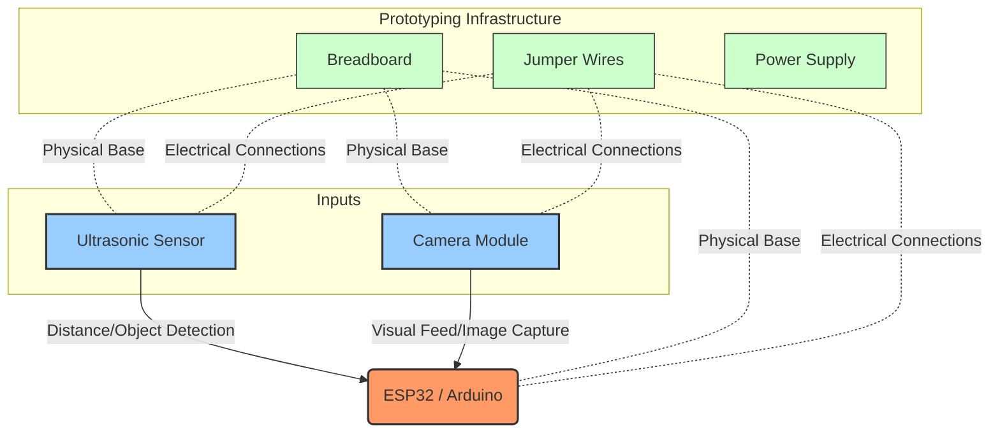

# Hardware Architecture & Block Diagram

The following block diagram outlines the hardware components and their connections for the project.

## Block Diagram

## Component List & Tools

### Core Components
1. **Microcontroller**: ESP32 / Arduino (Brain of the system, processes sensor data and camera images)
2. **Distance Sensor**: Ultrasonic Sensor (e.g., HC-SR04 - used for proximity and object detection)
3. **Vision Sensor**: Camera Module (e.g., OV7670 or ESP32-CAM module - used for visual monitoring and processing)

### Prototyping Tools
1. **Breadboard**: Used as the foundational base for temporary, solderless circuit building.
2. **Jumper Wires**: Used to establish electrical connections between the microcontroller, sensors, and the breadboard (Male-to-Male, Male-to-Female, Female-to-Female).
3. **Power Source**: USB Cable (for programming and power) or external battery/power supply module.
