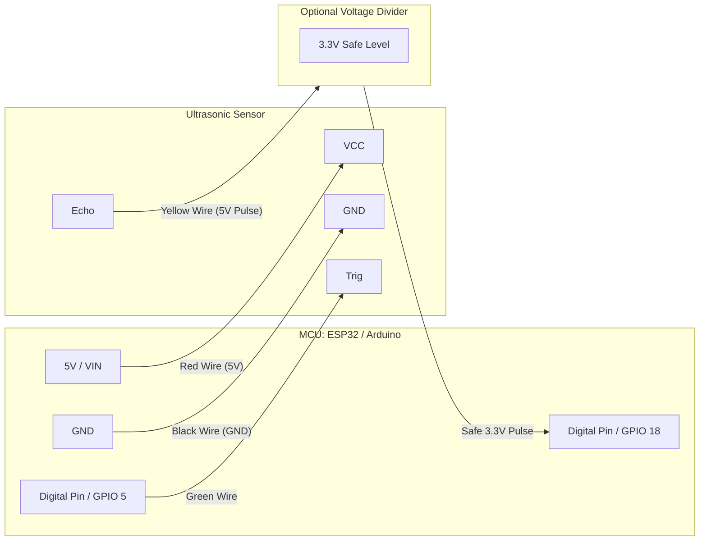

# Pin-to-Pin Wiring Diagram

This document details the exact pin configurations required to connect the sensors to your microcontroller.

## 1. Ultrasonic Sensor (HC-SR04) Wiring
The HC-SR04 requires 4 pins: Power (VCC), Ground (GND), Trigger (Send pulse), and Echo (Receive pulse).

| Ultrasonic Sensor (HC-SR04) | ESP32 Pin | Arduino Uno Pin | ESP8266 (NodeMCU) Pin | Description |
| :--- | :--- | :--- | :--- | :--- |
| **VCC** | 5V / VIN | 5V | VIN / 5V | 5V Power Supply |
| **GND** | GND | GND | GND | Ground |
| **Trig** | GPIO 5 (D5) | Digital Pin 9 | D1 (GPIO 5) | Trigger Pulse (Output from MCU) |
| **Echo** | GPIO 18 (D18) | Digital Pin 10 | D2 (GPIO 4) | Echo Receive (Input to MCU) |

> **Note on Voltage (ESP32 / ESP8266):** The HC-SR04 outputs a 5V signal on the Echo pin, but ESP32/ESP8266 logic pins operate strictly at 3.3V. While some boards tolerate 5V, using a **voltage divider circuit** (e.g., using a 1kΩ and 2kΩ resistor) on the Echo pin is strongly recommended to step the 5V down to 3.3V to protect your microcontroller.

## 2. Camera Module Wiring
Wiring instructions for the camera depend entirely on the setup you choose. You will likely be using either an **ESP32-CAM** (which has the camera built-in) or a standalone camera like the **OV7670**.

### Option A: Using ESP32-CAM / AI-Thinker Module (Highly Recommended)
If you are using the ESP32-CAM module, the OV2640 camera is already pin-mapped and connected internally. **No external camera wiring is necessary.** You only need to wire the Ultrasonic sensor to the available GPIO pins.
* **Available pins for HC-SR04 on ESP32-CAM:** You can safely use `GPIO 12`, `GPIO 13`, `GPIO 14`, or `GPIO 15` for the `Trig` and `Echo` pins.

### Option B: External OV7670 Camera to standard ESP32
If you are manually wiring an external camera module (like the OV7670) to a standard ESP32:

| Camera Module (OV7670) | ESP32 Pin | Description |
| :--- | :--- | :--- |
| **3V3** | 3.3V | 3.3V Power Supply |
| **GND** | GND | Ground |
| **SIOC** | GPIO 27 (SCL) | I2C Clock |
| **SIOD** | GPIO 26 (SDA) | I2C Data |
| **VSYNC** | GPIO 25 | Vertical Sync |
| **HREF** | GPIO 23 | Horizontal Reference |
| **PCLK** | GPIO 22 | Pixel Clock |
| **XCLK** | GPIO 21 | System Clock |
| **Pins D0-D7** | GPIOs 32, 35, 34, 5, 39, 18, 19, 36 | 8-bit Parallel Data pins |

## 3. Power Architecture & Breadboard Layout
To keep your wiring clean and organized on the breadboard:
1. Connect the Microcontroller's `GND` to the Breadboard's common negative (`-`) rail.
2. Connect the Microcontroller's `5V` (or `VIN`) to the Breadboard's common positive (`+`) rail.
3. Power the HC-SR04 `VCC` and `GND` from these common breadboard rails using jumper wires.
4. Route the `Trig` and `Echo` data pins using direct jumper wires to your designated Microcontroller GPIO pins.

## Visual Wiring Graph (Ultrasonic to MCU)

